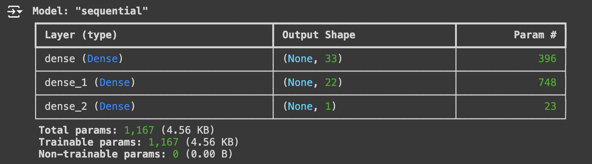
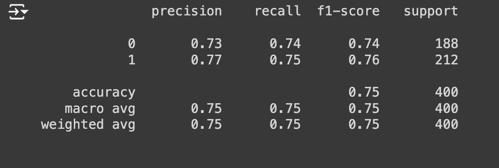

# neural-network-challenge-1
Week 18 Challenge

## Summary

This application analyzes student loan data and creates a model to predict loan repayment. The neural network package utilized was TensorFlow with Keras.

## Approach

The approach consisted of:

1) Read the csv file to ingest the data and preprocess.
2) Create X and y datasets.
3) Create training and testing datasets.
4) Scale the training data.
5) Create a neural network model.
6) Compile and fit the model.
7) Evaluate the model using test data.
8) Save and export the model.
9) Reload the model.
10)Make predictions.

Model Structure

Balanced Accuracy Score

## Plagerism Statement

No specific code was copied but the source below was referenced for examples and syntax. 

## Sources

https://keras.io/guides/serialization_and_saving/
